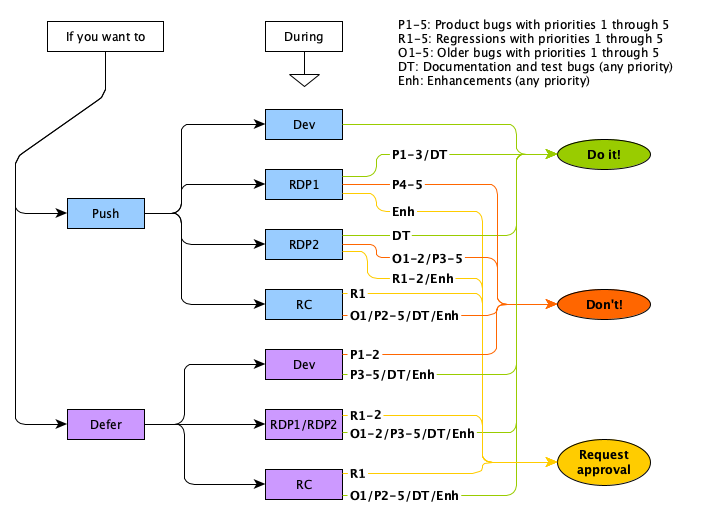

# The JDK Release Process

::: {.box}
[Quick Links]{.boxheader}

* [JEP 3: JDK Release Process](https://openjdk.org/jeps/3)
:::

The JDK Project has a well defined release process. [JEP 3](https://openjdk.org/jeps/3) describes this process in detail. This section intends to clarify some topics that often cause questions.

## Release cycle

The release cycle starts when development of a new release begins, and ends when that release is delivered to the public. The current release cadence is six months. This means that every six months we start development of a new release, and every six months a new release is delivered. However, this doesn't mean that each release cycle is six months. As described below, the total development time for a release (the release cycle) is actually nine months. Obviously this in turn doesn't mean that all features are developed in nine months. Most features are developed for a much longer time than that, and goes through long time development in other Project repositories, and through a series of preview and experimental stages. But any feature that is to be included in a specific release has a specific window of nine months to integrate the code into mainline and fix all the remaining bugs.

It may be tempting to integrate a new feature near the end of a release cycle, to get more time to fix all those last bugs before integration. Please don't. If you are getting close to the end of a release and you still just have one more bug to fix, please defer your feature to the next release. It's only six months out. Not only will this vouch for your new feature to be more stable on release, you will also help keeping the JDK as a whole more stable by allowing others to find and fix bugs in their new code that might come as a result of your changes.

Integrating early in a release is preferable, but all new features can't be integrated at the same time. If many large changes enters the repository at the same time it will be more difficult to determine which change that caused all the new bugs. If you're about to integrate a larger change you must therefore communicate this on the relevant [mailing lists] to synchronize with other Projects that may also be planning to integrate something soon.

## Milestones and phases

Throughout the release there are a number of milestones and phases that define where in the release cycle we are.

[**The start of a release**]{#release-start}
:    Since development is always ongoing in the master branch of the mainline repository ([openjdk/jdk](https://github.com/openjdk/jdk)), the start of a new release can be said to be when the former release is branched for stabilization. After the start of the release follows six months of development to implement and integrate all the cool stuff that will go into the next release. After these six months ramp down begins.

[**Ramp Down Phase 1 (RDP1)**]{#rdp1}
:    The ramp down of a release starts with a new branch being created (the stabilization branch) from the master branch in the mainline repository. During the ramp down of a release we focus on bug fixing and stabilization in order to get the JDK ready for release. In RDP1 you may continue to fix P1-P3 product bugs (and some other issues) in the stabilization branch. For detailed information on what can be fixed when, see [Push or defer during ramp down] below. The start of RDP1 is essentially the deadline for integrating JEPs and enhancements into a particular release.

[**All Tests Run (ATR)**]{#atr}
:    ATR is not a milestone described in JEP 3, but it's still a concept that might be mentioned in discussions on this topic and is therefore good to know about. ATR (a.k.a. ATR Start) is the start of an approximately six week long test period where all tests in the test plan for the given release is ran. ATR usually starts at the same time as RDP1.

[**Ramp Down Phase 2 (RDP2)**]{#rdp2}
:    In RDP2 the bar is higher to get changes into the release. For product bugs, only P1:s and P2:s are supposed to be fixed here, and to do so an approval is needed. See the [Fix-Request Process](https://openjdk.org/jeps/3#Fix-Request-Process) for details on how to obtain one. All other product bugs should be deferred. See [Push or defer during ramp down] below for more details. Also note that there is no guarantee that localization can be done for changes made in RDP2.

[**Release Candidate (RC)**]{#rc}
:    Towards the end of the release cycle, when there are no more open product bugs targeted to the release, a stable build is selected to be the release candidate. This build will go through additional testing and if no more issues are found it will be the build released. If new bugs are found these are investigated and hopefully fixed, and a new build becomes the release candidate. The RC phase has a few milestones with a deadline for finding a candidate build, and another for making sure the build is ready to go live.

[**General Availability (GA)**]{#ga}
:    This is the end of the release cycle. The last release candidate build is made available to the public.

### Push or defer during ramp down

[JEP 3](https://openjdk.org/jeps/3) contains the exact definitions for what can be done when. This is a visualization of those definitions that may or may not clarify things.

### Deferring P1 and P2 bugs

Even though there's nothing explicitly written in the process about deferring P1 and P2 bugs during the initial development phase, the assumption is that these aren't deferred unless time runs out at the end of the release cycle.

Please note that the priority of a bug doesn't change just because you want to get your fix in late in the release, or if you want to be able to defer it. The priority is based on the severity of the bug and if it was deemed to be a P2 before, you better have a really good explanation to why that conveniently has changed by the end of the release. Being hard to fix is **not** a reason to lower the priority of a bug.

::: {.box}
[To the top](#){.boxheader}
:::
