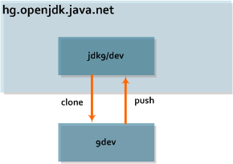

% Repositories

::: {.NavBit}
[« Previous](processWorkflow.html) • [TOC](index.html) • [Next »](mailingLists.html)
:::

This section describes the OpenJDK repository terminology and naming scheme. It
also includes minimal instructions to acquire source from the OpenJDK
repository,
[`https://hg.openjdk.java.net/`](https://hg.openjdk.java.net/).

> ---
> Note that source may be available from other locations, for example
> `src.zip` from a full JDK distribution. However,
> OpenJDK contributions must use source from the
> [OpenJDK Mercurial repository](https://hg.openjdk.java.net/)
> since other source distributions may contain older code
> or code which differs due to licensing.

> ---

Operations which are performed repeatedly, such as creating changesets,
merging, and pushing are described in [Producing a Changeset](producingChangeset.html).

* [Terminology and Naming Scheme](#terminology-and-naming-scheme) defines the
nomenclature used by OpenJDK.
* [Installing and Configuring Mercurial](#installing-and-configuring) enumerates the required software, provides links for
download, and describes basic installation and configuration.
* [Cloning](#clone) covers the procedure for
obtaining private copies of source repositories.

This document assumes familiarity with the first two chapters of the free
on-line book [Mercurial: The Definitive Guide](http://hgbook.red-bean.com).

## Terminology and Naming Scheme

The OpenJDK code base for all
[Projects](https://openjdk.java.net/bylaws#_6) is
stored in Mercurial repositories which contain the source files and their
change history. Some Projects may choose to organize their code into multiple,
possibly related, Mercurial repositories. For instance,
[JDK 9](https://openjdk.java.net/projects/jdk9)
uses a forest of multiple related repositories which contain components of the
entire JDK. Projects which are based on the JDK, such as
[IcedTea](https://openjdk.java.net/projects/icedtea)
and
[Jigsaw](https://openjdk.java.net/projects/jigsaw)
also use this model. In contrast,
[Code Tools](https://openjdk.java.net/projects/code-tools) uses an unrelated repository for each tool and
[Graal](https://openjdk.java.net/projects/graal)
uses only a single repository. Regardless of how a Project has chosen to store
their code, each
[Contributor](https://openjdk.java.net/bylaws#contributor)
clones the repository associated with the code they are modifying.

> ---
> Consult the Project's documentation or
> [mailing list](https://mail.openjdk.java.net) to
> determine the appropriate repository, development conventions, and helpful
> tools.

> ---

This is the typical development model:

::: {style="text-align:center;"}

:::

A Contributor creates a _clone_ (a local copy called
"9dev") of a read/write repository ("jdk9/dev") which resides on the OpenJDK
Mercurial server. They work on their change in the clone and locally
_commit_ a changeset. After the new changeset(s) are
verified, they're either _pushed_ directly from the
clone or _exported_ and delivered to a
[Committer](https://openjdk.java.net/bylaws#committer)
who can perform the push into the server repository for all to see.

> ---
> The use of _gate repositories_ was eliminated when the
> Mercurial servers were upgraded in March 2014.

> ---

The repositories use the following naming scheme:

> `<project>/<component_path>`

where

> ------------------  ----  ----------------------------------------------------
> _project_            ::   the short name of an OpenJDK [Project](https://openjdk.java.net/bylaws#_6) such as "jdk9", "openjfx", or "sumatra"
> _component_path_     ::   the path to a repository containing the code base as designated by the [Project Lead](https://openjdk.java.net/bylaws#project-lead).
> ------------------  ----  ----------------------------------------------------

## Installing and Configuring Mercurial

Mercurial is a free, cross-platform, distributed source management tool. Source
bundles and binary packages for Mercurial are available at
[https://www.selenic.com/mercurial/wiki/index.cgi](https://www.selenic.com/mercurial/wiki/index.cgi/Mercurial).
The OpenJDK repositories recommend installation of Mercurial 2.6.3 (or later).
A Mercurial installation is sufficient to clone a repository. Contributors who
wish to submit changes will need some additional configuration as described
below.

Some Projects may recommend additional tools or scripts that help with
repository manipulation and code development. For instance, in JDK 9, the
utility script `common/bin/hgforest.sh` may be
used to apply commands to all the repositories in the
[forest](glossary.html#forest). Popular extensions for OpenJDK developers include
[jcheck](https://openjdk.java.net/projects/code-tools/jcheck/),
[trees](https://openjdk.java.net/projects/code-tools/trees/), and
[Mercurial Queues](http://hgbook.red-bean.com/read/managing-change-with-mercurial-queues.html)
(mq). Note that `trees` is enabled on the OpenJDK Mercurial server.

Create and edit the `~/.hgrc` file to minimally contain the following entry:

>     [ui]
>     username = <openjdk_username>

_openjdk\_username_ is a plain lowercase, alphanumeric
token (not an e-mail address) with twelve characters or less. The first
character should be alphabetic. This username will be publicly visible in all
Mercurial changeset logs. It will be used to verify that the changeset author
is at least an
[Author](https://openjdk.java.net/bylaws#author)
for the Project and that the person pushing the changeset is at least a
[Committer](https://openjdk.java.net/bylaws#committer).
It is recommended that the _openjdk\_username_ be
somehow related to the Author's full name, such as the first character of the
Author's first name followed by the Author's last name. Refer to the
[Becoming an Author](../projects/index.html#project-author) section of the
[Project](../projects/index.html) page for
additional information.

An alphabetical list of all of the assigned
_openjdk\_usernames_ may be found on the
[OpenJDK people](https://db.openjdk.java.net/people) list. The
[Census](../census) shows the structure of the OpenJDK Community.

#### Verifying the Configuration

After installing and configuring Mercurial, validate the configuration using
the following steps.

#. Verify that Mercurial is version 2.6.3 (or newer).

   >     $ hg version
   >     Mercurial Distributed SCM (version 2.9)
   >     (see http://mercurial.selenic.com for more information)
   >
   >     Copyright (C) 2005-2014 Matt Mackall and others
   >     This is free software; see the source for copying conditions. There is NO
   >     warranty; not even for MERCHANTABILITY or FITNESS FOR A PARTICULAR PURPOSE.

#. Verify that the list of enabled extensions includes fetch and mq.

   >     $ hg help
   > [full output](hgHelp.html)

#. Verify that the `~/.hgrc` configuration looks correct. Minimally it should contain the following entries:

   >     $ hg showconfig
   >     ui.username=iris

At this point, it should be possible to start retrieving source from the
repositories.

## Cloning

With Mercurial each developer works with a clone of the repository which is a
snapshot of the files at the time the clone was taken. To update the clone, see
[Producing a Changeset](producingChangeset.html).

#### ... a Sandbox Repository {#cloneSandbox}

In addition to the Project repositories, there are some test repositories that
may be used to run test commands against Mercurial without fear of causing
damage to development source. Use them freely but with discretion; content in
them may be deleted at any time.

>     $ mkdir sandbox; cd sandbox
>     $ hg clone http://hg.openjdk.java.net/sandbox/box
>     destination directory: box
>     requesting all changes
>     adding changesets
>     adding manifests
>     adding file changes
>     added 23 changesets with 24 changes to 5 files
>     4 files updated, 0 files merged, 0 files removed, 0 files unresolved
>     $ du -s box
>     46      box

#### ... a Forest {#cloneForest}

If a Project uses a forest, It is strongly recommended for developers to clone
an entire forest, rather than a single repository. This is the only means to
ensure consistency in builds. The following examples illustrate two
alternatives for cloning the entire _jdk9/dev_ forest
into the directory `9dev`.

#. To clone the forest using the
[trees](https://openjdk.java.net/projects/code-tools/trees/)
extension just use `tclone`:

   >     $ hg tclone http://hg.openjdk.java.net/jdk9/dev 9dev
   > [full output](tClone.html)

#. To clone the forest using `get_source.sh`, first
clone the main tree:

   >     $ hg clone http://hg.openjdk.java.net/jdk9/dev 9dev
   >     requesting all changes
   >     adding changesets
   >     adding manifests
   >     adding file changes
   >     added 997 changesets with 1477 changes to 138 files
   >     updating to branch default
   >     82 files updated, 0 files merged, 0 files removed, 0 files unresolved

   Then clone the repositories in the forest:

   >     $ cd 9dev
   >     $ sh ./get_source.sh
   > [full output](getSource.html)

Regardless of how the forest was cloned, this is the resulting populated
forest.

>     $ du -s
>     934532  .
>     $ ls
>     ASSEMBLY_EXCEPTION  hotspot    LICENSE   README-builds.html
>     common              jaxp       make      test
>     configure           jaxws      Makefile  THIRD_PARTY_README
>     corba               jdk        nashorn
>     get_source.sh       langtools  README

#### ... a Single Repository {#cloneSingle}

If the source for the Project is contained within a single repository or
reading a limited portion of the source is the only goal, it is possible to
clone a single repository (even if it's part of a forest). For instance, this
example shows how to clone the `langtools`
repository from _jdk9/dev_ into the default
destination directory.

>     $ hg clone http://hg.openjdk.java.net/jdk9/dev/langtools
>     destination directory: langtools
>     requesting all changes
>     adding changesets
>     adding manifests
>     adding file changes
>     added 2289 changesets with 21194 changes to 7004 files
>     updating to branch default
>     6212 files updated, 0 files merged, 0 files removed, 0 files unresolved
>     $ du -s langtools
>     84396   langtools

::: {.NavBit}
[« Previous](processWorkflow.html) • [TOC](index.html) • [Next »](mailingLists.html)
:::
